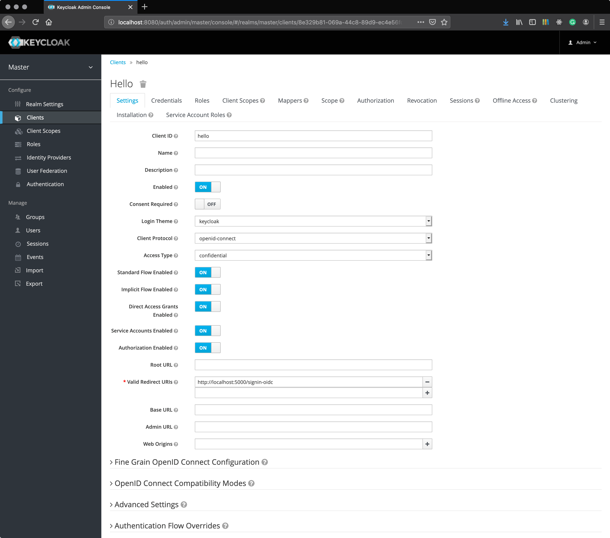

## Keycloak

#### 1. Start server

```bash
docker run --name keycloak -p 8080:8080 -e KEYCLOAK_USER=admin -e KEYCLOAK_PASSWORD=admin jboss/keycloak
```

#### 2. Add client



#### 3. Test

```bash
dotnet run --project src/Connect22/Connect22.csproj
open http://localhost:5000/api/hello/hello
```